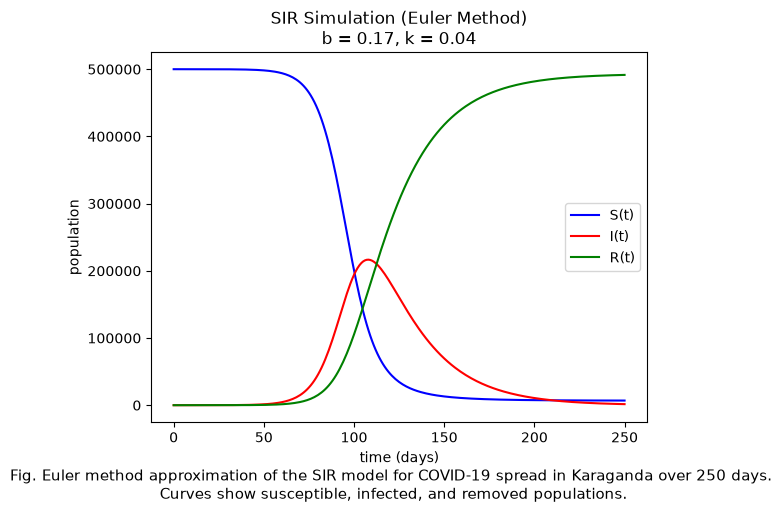
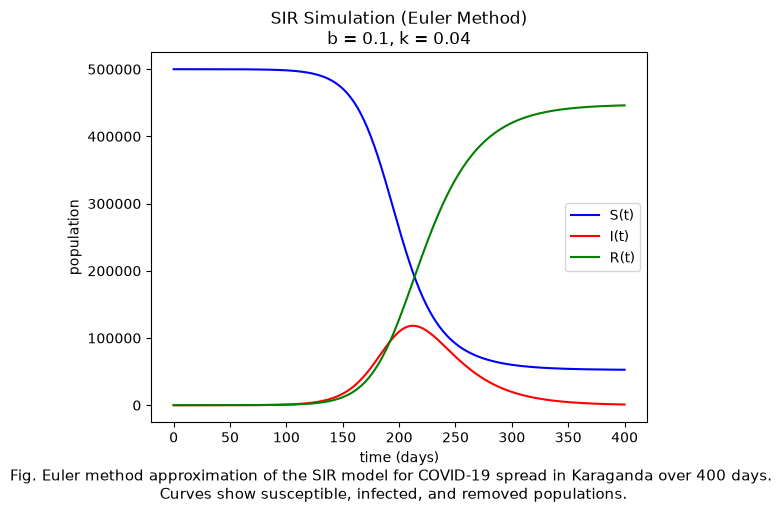
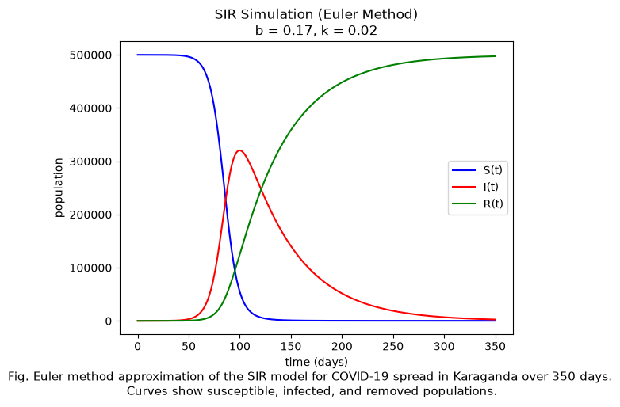
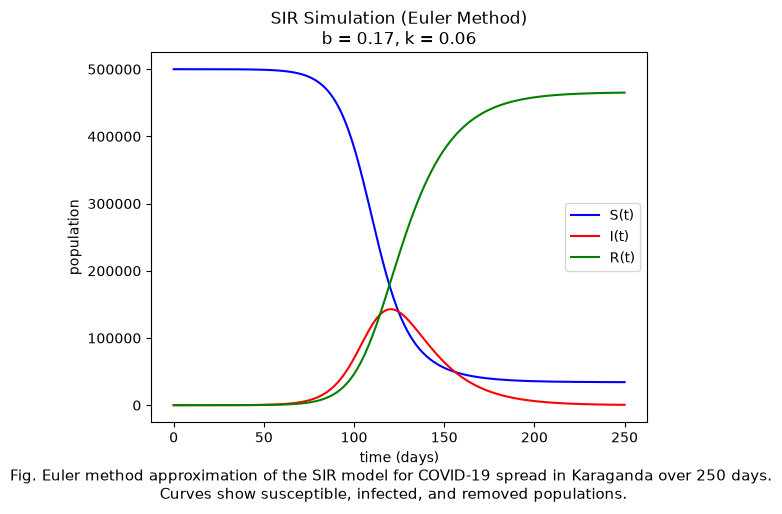

# SIR epidemic simulation

A small numerical simulation of how COVID-19 could spread through Karaganda, Kazakhstan, using the SIR model and Euler's method written from scratch in Python.



## The model

The population is split into three groups: susceptible `S`, infected `I` and removed `R`.

```
dS/dt = -b·S·I / N
dI/dt =  b·S·I / N - k·I
dR/dt =  k·I
```

`b` is the infection rate and `k` the removal rate. The equations have no closed-form solution, so `SIR_Euler` steps them forward one day at a time: next value = current value + step × derivative.

## Parameters

| Parameter | Value | Source |
| :--- | :--- | :--- |
| Population | 500,000 susceptible, 3 infected | Approximate size of Karaganda |
| Infection rate `b` | 0.17 | Mean transmission rate for Karaganda in Koichubekov et al. (2023) |
| Removal rate `k` | 0.04 | Baseline choice |
| Step size | 1 day | |

The reported standard deviation of `b` is 0.075, so the notebook also runs `b = 0.10` and `b = 0.25` to cover roughly one standard deviation either side, and `k = 0.02` and `k = 0.06` to see the effect of slower and faster removal.

## Results

| Lower infection rate (b = 0.10) | Higher infection rate (b = 0.25) |
| :---: | :---: |
|  |  |

| Lower removal rate (k = 0.02) | Higher removal rate (k = 0.06) |
| :---: | :---: |
|  |  |

A higher infection rate gives an earlier and taller peak of infections. A higher removal rate lowers and flattens the peak, and leaves more of the population never infected.

## Assumptions and limits

- Everyone mixes with everyone equally; there are no households, ages or districts.
- `b` and `k` stay constant, so lockdowns, vaccination and behaviour change are not modelled.
- The population is fixed: no births, deaths from other causes, or travel.
- Euler's method with a one-day step is a first-order approximation. A smaller step or a higher-order method would track the true solution more closely.

## Run it

```sh
pip install -r requirements.txt
jupyter notebook sir_euler.ipynb
```

## Background

Written for a formal analysis course at Minerva University (spring 2026). The code is my own.

## References

- Koichubekov, B., Takuadina, A., Korshukov, I., Turmukhambetova, A., & Sorokina, M. (2023). Is it possible to predict COVID-19? Stochastic system dynamic model of infection spread in Kazakhstan. *Healthcare, 11*(5), 752. https://doi.org/10.3390/healthcare11050752
- Nelson, P. H. (2021). Introductory models of COVID-19 in the United States. arXiv. https://arxiv.org/abs/2104.08856
